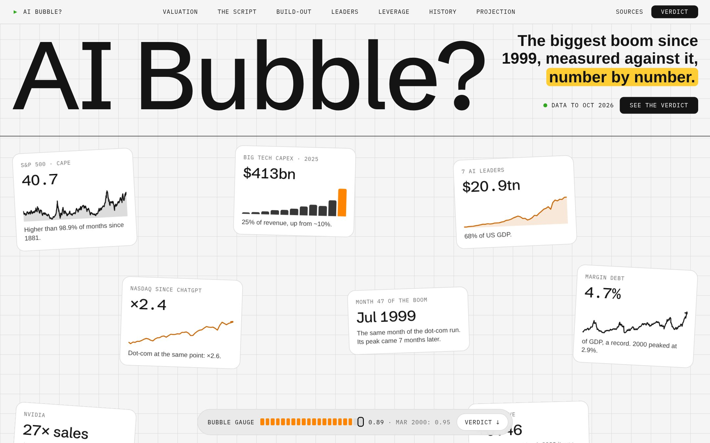
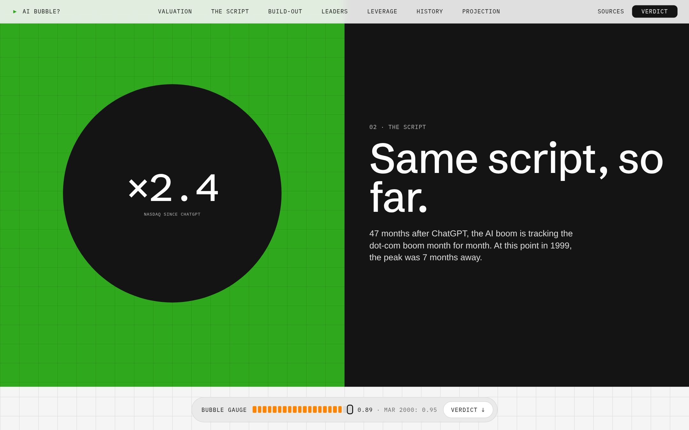
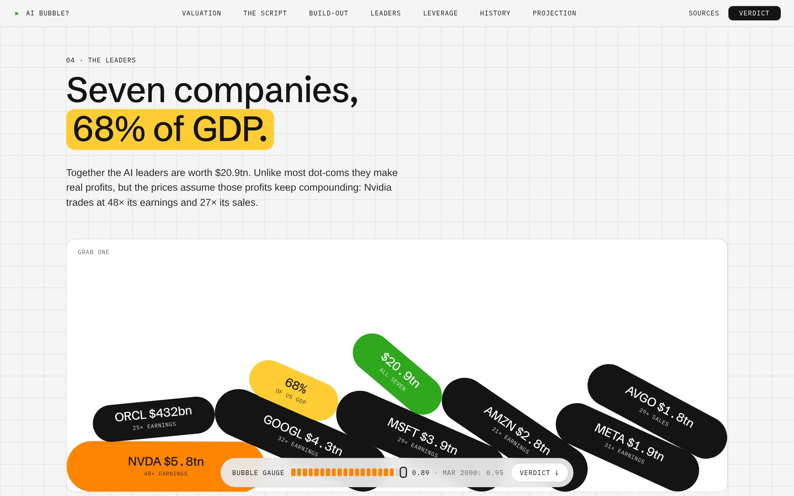
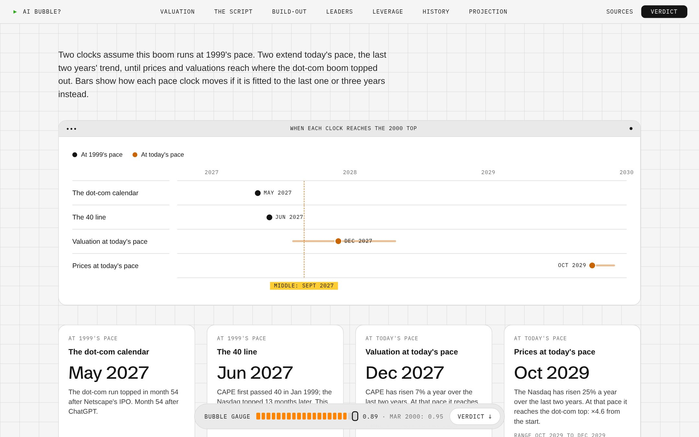
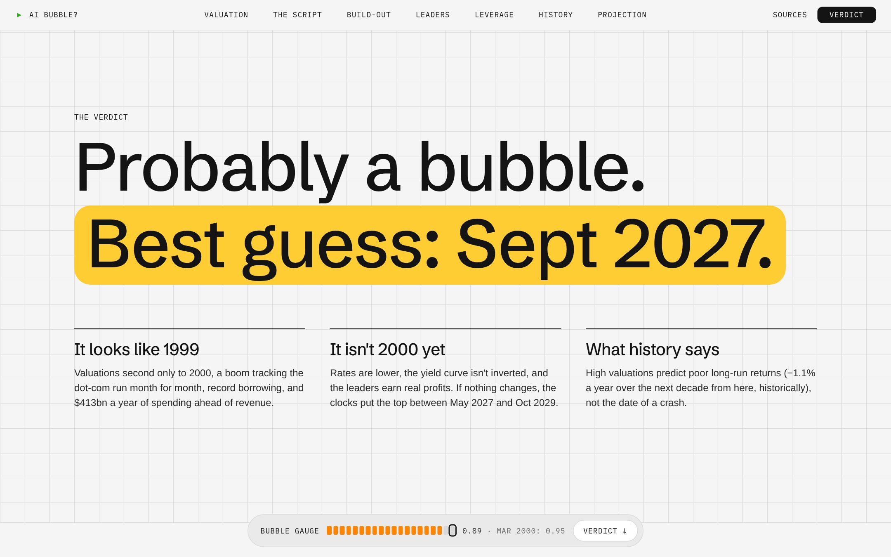
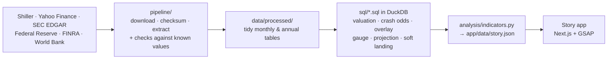

<div align="center">

# AI Bubble?

**The biggest boom since 1999, measured against it, number by number.**

Today's AI boom set against the dot-com bubble on the same yardsticks,<br>
and 150 years of market history on what tends to come next.

### [**Read the story →**](https://ai-bubble-vs-dotcom.vercel.app)

<a href="https://ai-bubble-vs-dotcom.vercel.app"></a>

</div>

---

Everyone has an opinion on whether AI is a bubble. This project replaces the opinion with measurements. It
puts today's market next to the dot-com boom on the yardsticks that defined 1999: how expensive stocks are,
how fast prices have run, how much is being spent ahead of revenue, how concentrated the market is, and how
much of it is bought with borrowed money. Then it asks what 150 years of history say usually follows, when
the top would come if nothing changes, and what could stop it.

## What it found

1. **Expensive, almost 1999 expensive.** The S&P 500's cyclically adjusted P/E (CAPE) is **40.7**, higher
   than in 98.9% of months since 1881. Only 1999–2000 was higher.
2. **Same script, so far.** 47 months after ChatGPT the Nasdaq is up **2.4×**. 47 months after Netscape's
   IPO, in July 1999, it was up 2.6×. The dot-com peak came seven months later, followed by a 75% fall.
3. **Spending like it's already paid off.** Microsoft, Alphabet, Amazon, Meta and Oracle spent **$413bn** on
   data centres in 2025: 25% of their revenue, and more than their combined profits for the first time
   since at least 2015.
4. **Seven companies, 68% of US GDP**, worth $20.9tn together. Margin debt, money borrowed to buy shares, is
   a record 4.7% of GDP (2000 peaked at 2.9%).
5. **But it isn't 2000 yet.** Interest rates are lower, the yield curve isn't inverted, and unlike most
   dot-coms the leaders make large, fast-growing profits.
6. **If nothing changes: September 2027.** Four independent clocks, two at 1999's pace and two at today's,
   put the top between May 2027 and October 2029. A backtest on 1929, 2000 and 2021 shows the valuation
   clock was early twice and late once, so the site treats the date as the middle of a wide range.
7. **It could deflate instead.** If profits keep outrunning prices, the leaders would be back to normal
   valuations in one to four years without a crash, as happened in 2022–24. Two of the four conditions for
   that soft landing hold today.

## A look inside

<table>
  <tr>
    <td width="50%"><br><sub><b>Same script, so far.</b> A pinned chart then draws the dot-com and AI runs month by month, up to "you are here".</sub></td>
    <td width="50%"><br><sub><b>The leaders.</b> Seven companies fall into a box as pills sized by market value. Grab one and throw it.</sub></td>
  </tr>
  <tr>
    <td width="50%"><br><sub><b>The projection.</b> Four clocks for when the boom tops out, with the range each one moves across.</sub></td>
    <td width="50%"><br><sub><b>The verdict.</b> Probably a bubble. What it looks like, what's different, and what history says.</sub></td>
  </tr>
</table>

## How it works



- **Six public sources, all kept raw.** Every downloaded file sits unedited in `data/raw/` with its URL and
  checksum, so the analysis can be rerun on exactly the data the site shows.
- **The pipeline checks itself against history.** It stops unless it reproduces known values: CAPE in 1929
  and 1999, the Nasdaq in 2000, Nvidia's 2024 revenue, Cisco's 86% fall after 2000, and more.
- **Every number is computed in SQL.** Seventeen DuckDB queries in `sql/`, one question each: window
  functions for the 36-month drawdowns and 10-year returns, ASOF joins to match prices to share counts and
  CPI, percentile ranks for the gauge, and `regr_slope` for the projection's trend lines. Each chart on the
  site has a **"Show the SQL"** panel with the exact query behind it. Python only runs the files, shapes the
  JSON and writes the sentences.
- **Honest statistics.** Crash odds are counted by independent episodes, not overlapping months, with
  Wilson confidence intervals, which is why they are wide. The projection shows how far each date moves when
  its trend is fitted over one, two or three years.

**Built with:** SQL (DuckDB) for the analysis; Python, pandas and uv for downloading and extraction;
Next.js, TypeScript, Tailwind CSS, GSAP, Lenis and Matter.js for the story.

## Run it yourself

```bash
uv sync && pipeline/run_all.sh          # downloads, extracts and runs the analysis
cd app && pnpm install && pnpm dev
```

## Project structure

```
03-ai-bubble/
├── README.md
├── docs/preview/               screenshots used in this README
├── pyproject.toml              Python deps (pandas, xlrd, openpyxl); run everything with `uv run`
├── pipeline/
│   ├── sources.py              every external file: URL and what it is used for
│   ├── 01_download.py          fetches sources into data/raw/, writes MANIFEST.csv
│   ├── 02_extract.py           raw files → tidy tables, with checks against known values
│   └── run_all.sh              rebuilds everything end to end
├── sql/                        every measure, one question per file (00_sources.sql sets up the tables)
│   ├── 01–05                   valuation, crash odds by month and by valuation band, high-CAPE episodes
│   ├── 06–07                   the boom-vs-boom overlay and the dot-com peak
│   ├── 08–11                   the build-out, market values (ASOF join), the chart series
│   ├── 12–14                   leverage, interest rates, the bubble gauge
│   └── 15–17                   the projection clocks, the soft-landing maths, peak-to-trough falls
├── analysis/
│   └── indicators.py           runs sql/ in order, checks the results → app/data/story.json
├── app/                        the story app (Next.js); reads only app/data/story.json
└── data/
    ├── raw/                    original files, never edited (MANIFEST.csv has URLs and checksums)
    ├── processed/              tidy monthly/annual tables
    └── analysis/               one CSV per finding
```

Rebuild: `pipeline/run_all.sh`

## Sources: what was used for what

| Raw files | What they are | Used for |
|---|---|---|
| `shiller/ie_data.xls` | Robert Shiller's monthly S&P data since 1871: price, dividends, earnings, CPI, CAPE (from shillerdata.com; the old Yale copy stopped in 2023) | Valuation vs history; what followed each valuation level |
| `yahoo/*.json` | Monthly prices (split- and dividend-adjusted): Nasdaq, S&P 500, the AI leaders (Nvidia, Microsoft, Alphabet, Amazon, Meta, Broadcom, Oracle) and the dot-com leaders (Cisco, Microsoft, Intel, Oracle, Qualcomm) | Boom-vs-boom overlay; market values |
| `sec/*.json` | SEC EDGAR XBRL company facts for the seven AI leaders: revenue, capex, net income, share counts | The build-out vs revenue; valuations |
| `fed/h15_treasury_yields.csv` | Federal Reserve H.15, daily Treasury yields at all maturities | Short rates and the yield curve, 2000 vs now |
| `finra/margin-statistics.xlsx` | FINRA margin debt, monthly since 1997 | Borrowed money in the market |
| `worldbank/us_gdp.json` | US GDP, annual | Scaling market values and margin debt |

## Detailed findings (data to October 2026)

1. **Valuation:** the S&P 500's CAPE is **40.7**, higher than in 98.9% of months since 1881. Only 1999–2000
   (peak 44.2) was higher; 1929 peaked at 32.6.
2. **Same script so far:** 47 months after ChatGPT, the Nasdaq is up 2.4× and the AI leaders 5.4×. At the
   same point after Netscape's IPO (July 1999), the Nasdaq was up 2.6× and the dot-com leaders 6.0×. The
   dot-com peak came seven months later, followed by a 75% fall.
3. **The build-out:** Microsoft, Alphabet, Amazon, Meta and Oracle spent **$413bn** on capex in 2025,
   **25% of their revenue**, against 7–12% before 2022.
4. **Concentration:** the seven AI leaders are worth **$20.9tn, 68% of US GDP**. Nvidia trades at 48× earnings
   and 27× sales.
5. **Leverage:** margin debt is **$1.45tn, 4.7% of GDP**, a record (the 2000 peak was 2.9%).
6. **What's different from 2000:** the yield curve isn't inverted (+0.46 points vs −0.27 in March 2000) and
   short rates are lower (4.2% vs 5.9%). The leaders are also highly profitable, unlike many dot-coms.
7. **What history says:** valuation is a poor crash timer. Periods with CAPE above 30 ended in a 30%+ fall
   in 2 of 3 episodes, but cheaper markets crashed at similar rates. It is a strong guide to the long run:
   from CAPE above 30, the median next-decade real return was **−1.1% a year**; from below 10, **+11%**.
8. **Bubble gauge** (average percentile of valuation, speed, leverage and distance above trend, 1997 on):
   **0.89** now vs **0.95** at the March 2000 peak, the highest reading on record.
9. **Projection, if nothing changes:** four clocks for when the boom tops out (`projection()` in
   `analysis/indicators.py`, written to `data/analysis/projection_clocks.csv`):
   - *Dot-com calendar* (1999's pace): the Nasdaq topped in month 54 after Netscape's IPO; month 54 after
     ChatGPT is **May 2027**.
   - *The 40 line* (1999's pace): CAPE first passed 40 in Jan 1999 and the Nasdaq topped 13 months later;
     it passed 40 again in May 2026, so **Jun 2027**.
   - *Valuation at today's pace*: CAPE's log-linear trend over the last 24 months reaches the 2000 peak
     (44.2) in **Dec 2027** (Aug 2027 to May 2028 with 12- or 36-month fits).
   - *Prices at today's pace*: the Nasdaq's 24-month trend (+25% a year) reaches the dot-com top
     (4.6× from the start) in **Oct 2029** (Oct to Dec 2029).

   The median of the four is **September 2027**; the window is May 2027 to Oct 2029. This is arithmetic
   on trends, not a forecast: it assumes nothing changes, and item 7 shows valuation alone has never
   timed a crash.

   **Backtest** (`sql/18_backtest.sql`): the valuation clock, run with only the data known at the time in
   the 24 months before each great valuation top. Early twice, late once:

   | Top | 12 months before, it said | 6 months before | 3 months before |
   |---|---|---|---|
   | Sep 1929 (record to beat: CAPE 25.2) | Dec 1928, 9 months early | "now", 6 early | "now", 3 early |
   | Dec 1999 (record: 32.6) | "now", 12 early | "now", 6 early | "now", 3 early |
   | Nov 2021 (record: 44.2) | Mar 2040 | Jun 2023, 19 late | Sep 2022, 10 late |

   When a boom breaks the old record (1929, 1999) the clock fires early; when the top comes below it (2021)
   the clock is late. Today CAPE is below the record, the 2021 pattern, so the top could come sooner than the
   clocks say. The dot-com calendar and the 40 line can't be backtested: both are built from 2000 itself.
10. **What could stop it** (`soft_landing()` in `analysis/indicators.py`): companies can't stop a bubble
    (Cisco, Intel and Oracle lost 81–86% after 2000 despite their analysts), but a boom can deflate
    instead of burst if four things hold. Two hold now:
    - *Profits outrun prices* (holding): the six leaders with current profits trade at 32× earnings, and
      their profits grew 41% a year from 2023 to 2025. If prices went nowhere, they would be back at 22×
      (the S&P 500's median since 1990) in 1.0 years, 1.9 at half that growth, or 3.6 at 10% a year.
    - *The build-out is paid from profits* (not holding): the hyperscalers' 2025 capex was 106% of
      their profits; until 2021 it never passed 73%.
    - *Money stays cheap* (holding): the yield curve isn't inverted and short rates are below 2000's.
    - *Borrowing stays in check* (not holding): margin debt is a record 4.7% of GDP.

    The precedent is 2017–2023: CAPE stayed above 30 for six years, the Nasdaq fell 33% from Dec 2021,
    and it was back at its high by Feb 2024. That was a deflation, not a burst.

## How it's checked

`02_extract.py` fails unless known values come out right: CAPE ≈ 44 in Dec 1999 and ≈ 32 in Sep 1929, Nvidia's
2024 revenue ≈ $130bn, Nasdaq ≈ 4,700 in Feb 2000, the 3-month yield > 5.5% in May 2000, and market values for
Nvidia and Alphabet in 2020 and 2024.

## Method notes

- **Share counts and splits:** SEC share counts are restated by later filings, so each count is adjusted only
  for splits after the date it was filed. Alphabet only tags diluted shares from 2022; its point-in-time share
  count fills the gap.
- **Crash odds:** months overlap (a 36-month window starting in January and one starting in February share 35
  months), so results are also reported by **episode**: runs of months in a valuation band separated by 3+ years.
  Confidence intervals (Wilson) use episodes, which is why they are wide.
- **Monthly averages smooth crashes:** Shiller's prices are monthly averages, so short crashes (March 2020)
  show smaller falls than daily data would.
- **P/E ratios** use the latest full year of profit; Broadcom's latest is 2024 (depressed by its VMware
  acquisition), so its P/E is not shown.
- **The gauge** ranks each month against the whole sample, including later months, so it describes where a
  month sits in history; it is not a forecast on its own.

## The story app

A scroll story in a "sketchpad" style (flim.ai reference): light grid-paper canvas, near-black ink, ember orange
for the AI era, a yellow marker highlight, a giant wordmark hero and a mono micro-type for labels.

- **Hero:** "AI Bubble?" wordmark over data snapshots scattered on the grid; they drop in on load and can be dragged
  and thrown (GSAP Draggable + Inertia).
- **Ticker** of the seven AI leaders' market values; an intro statement whose words light up as you scroll (SplitText).
- **Same script:** a pinned chart draws the dot-com and AI Nasdaq runs month by month to "you are here", then lets
  the dot-com line run on to its peak and crash.
- **The leaders:** the seven companies drop into a box as pills sized by market value (Matter.js physics; grab one).
- Charts in app-style windows for valuation, capex, margin debt, crash odds and the gauge; split-panel chapter
  openers; a fixed bottom pill showing the bubble gauge; smooth scrolling (Lenis).
- Every animation's end state is what the server renders: reduced-motion readers and phones get the full story
  without the physics or dragging.

Fonts are free stand-ins for the reference's commercial faces: Schibsted Grotesk for Swizzy, IBM Plex Mono for
PP Neue Montreal Mono; body text is Arial as in the reference.
